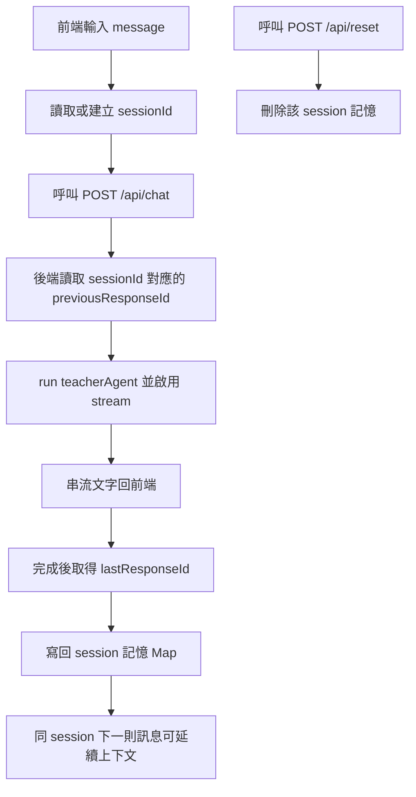

# OpenAI Agents SDK for TypeScript - Web UI 串流聊天範例

這是一個最小可執行範例，示範如何用 OpenAI Agents SDK 建立具備 UI 的聊天 agent，並在前端即時顯示串流輸出。

## 1) 安裝套件

```bash
npm install
```

## 2) 設定 API Key

```bash
cp .env.example .env
```

接著把 `.env` 裡的 `OPENAI_API_KEY` 改成你的金鑰，並設定 `MS_LEARN_MCP_URL`：

```dotenv
OPENAI_API_KEY=your_openai_api_key_here
MS_LEARN_MCP_URL=https://your-ms-learn-mcp-endpoint.example.com
CHAT_CONFIG_PATH=./config/chat.json
```

`ChatService` 參數改為設定檔驅動，預設讀取 `config/chat.json`。

- 覆蓋優先序：預設值 < `config/chat.json` < 環境變數 < 程式注入（測試）
- 可透過 `CHAT_CONFIG_PATH` 指定不同設定檔路徑
- 目前支援環境變數覆蓋：
  - `MS_LEARN_MCP_URL`
  - `CHAT_SERVICE_NAME`
  - `CHAT_MODEL_GENERAL`
  - `CHAT_MODEL_CSHARP`
  - `CHAT_MODEL_CSHARP_FALLBACK`
  - `CHAT_ROUTING_ENABLE_CSHARP_ROUTE`
  - `CHAT_ROUTING_CSHARP_ONLY_USES_MCP`

### 參數化配置如何生效

設定會在啟動時由 `loadChatConfig()` 載入，並在建立 `ChatService` 時固定下來（非熱更新）。

> 補充：`CHAT_CONFIG_PATH` 屬於「執行時」設定，主要影響 `dev:*` / `start:*`；`build` 階段只負責編譯程式碼。

1. 先載入內建預設值（`src/config/chatConfig.ts`）
2. 再合併 `config/chat.json`（或 `CHAT_CONFIG_PATH` 指定檔案）
3. 再套用環境變數覆蓋
4. 最後可由程式注入（例如測試中的 `new ChatService({ config })`）覆蓋

### 參數作用對照（改了會影響哪裡）

| 設定鍵                                 | 作用位置                                   | 影響行為                                    |
| -------------------------------------- | ------------------------------------------ | ------------------------------------------- |
| `serviceName`                          | `GET /api/health` 回傳欄位 `service`       | 影響健康檢查顯示的服務名稱                  |
| `mcp.msLearnUrl`                       | `ChatService` 建立 MCP 連線 client         | 決定是否啟用 MS Learn MCP；空字串代表不啟用 |
| `agents.general.model`                 | 一般問題的 `generalAgent`                  | 影響非 C# 路由使用的模型                    |
| `agents.general.instructions`          | 一般問題的 `generalAgent`                  | 影響非 C# 問題回答風格                      |
| `agents.csharp.model`                  | C# 問題的 `csharpAgent`                    | 影響 C# + MCP 路由使用的模型                |
| `agents.csharp.instructionsWithMcp`    | `hasMsLearnMcp = true` 時的 `csharpAgent`  | 影響可用 MCP 時的 C# 回答指令               |
| `agents.csharp.instructionsWithoutMcp` | `hasMsLearnMcp = false` 時的 `csharpAgent` | 影響無 MCP 時的 C# 回答指令                 |
| `agents.csharpFallback.model`          | C# fallback agent                          | 影響 C# 主路由失敗後的備援模型              |
| `agents.csharpFallback.instructions`   | C# fallback agent                          | 影響 C# 備援回覆風格                        |
| `csharpKeywords[]`                     | `isCSharpQuery()` 關鍵字判斷               | 決定哪些訊息會走 C# 路由                    |
| `routing.enableCsharpRoute`            | `streamChat()` 路由入口                    | `false` 時所有訊息都走一般路由              |
| `routing.csharpOnlyUsesMcp`            | `GET /api/health` 的 `routing` 欄位        | 僅影響健康檢查揭露資訊，不改變執行流程      |
| `sourceBlock.rule`                     | C# / C# fallback agent instructions 尾段   | 要求模型回覆附來源區塊                      |
| `sourceBlock.fallback`                 | 串流結束後的補尾機制                       | 若 C# 回覆缺 `【來源】`，伺服器會補上這段   |

### 環境變數對應到哪些設定鍵

| 環境變數                            | 覆蓋設定鍵                    |
| ----------------------------------- | ----------------------------- |
| `MS_LEARN_MCP_URL`                  | `mcp.msLearnUrl`              |
| `CHAT_SERVICE_NAME`                 | `serviceName`                 |
| `CHAT_MODEL_GENERAL`                | `agents.general.model`        |
| `CHAT_MODEL_CSHARP`                 | `agents.csharp.model`         |
| `CHAT_MODEL_CSHARP_FALLBACK`        | `agents.csharpFallback.model` |
| `CHAT_ROUTING_ENABLE_CSHARP_ROUTE`  | `routing.enableCsharpRoute`   |
| `CHAT_ROUTING_CSHARP_ONLY_USES_MCP` | `routing.csharpOnlyUsesMcp`   |

> 注意：目前環境變數只覆蓋上表欄位；其餘欄位請在 `chat.json` 設定。

### 常見調整情境（可直接套用）

#### 1) 暫時關閉 C# 專用路由（全部走一般 agent）

在 `.env` 設定：

```dotenv
CHAT_ROUTING_ENABLE_CSHARP_ROUTE=false
```

效果：`isCSharpQuery()` 不再影響路由，所有訊息都走 `generalAgent`。

#### 2) 只替換一般問答模型（不改 C# 模型）

在 `.env` 設定：

```dotenv
CHAT_MODEL_GENERAL=gpt-4.1
```

效果：僅一般問題改用新模型；C# 路由仍使用 `agents.csharp.model`。

#### 3) 自訂來源區塊文案（補尾與指令一起調整）

在 `config/chat.json` 調整：

```json
{
  "sourceBlock": {
    "rule": "回覆最後請附來源：\n【來源】\n- ...",
    "fallback": "\n\n【來源】\n- 無（本次未使用 MCP）"
  }
}
```

效果：

- `sourceBlock.rule`：會附加到 C# / C# fallback agent 的 instructions
- `sourceBlock.fallback`：當 C# 串流回覆沒有 `【來源】` 時，伺服器補上的文字

#### 4) 依環境切換不同設定檔（dev / staging / prod）

先建立多份設定檔（例如 `config/chat.dev.json`、`config/chat.staging.json`、`config/chat.prod.json`）。

啟動時指定：

```bash
CHAT_CONFIG_PATH=./config/chat.dev.json npm run dev
```

部署環境可改成：

```bash
CHAT_CONFIG_PATH=./config/chat.staging.json npm start
CHAT_CONFIG_PATH=./config/chat.prod.json npm start
```

效果：

- `loadChatConfig()` 會優先讀取 `CHAT_CONFIG_PATH` 指定檔案
- 不同環境可維持不同模型、指令、路由策略
- 仍保留環境變數覆蓋能力（例如臨時覆蓋 `CHAT_MODEL_GENERAL`）

可搭配 `package.json` 內建 scripts：

```bash
npm run dev:local
npm run dev:staging
npm run dev:prod
npm run start:staging
npm run start:prod
```

建置（compile）流程不分環境，統一使用：

```bash
npm run build
```

## 3) 執行範例

```bash
npm run dev
```

執行測試（Vitest）：

```bash
npm test
```

依類型執行：

```bash
npm run test:integration
npm run test:unit
npm run test:e2e
```

開啟瀏覽器進入：

```text
http://localhost:3000
```

在 UI 中輸入訊息後，agent 回覆會以串流方式逐步顯示。

可先用健康檢查端點確認設定是否生效：

```bash
curl http://localhost:3000/api/health
```

你會看到：

- `openAiApiKeyConfigured`：`OPENAI_API_KEY` 是否已設定
- `msLearnMcpConfigured`：`MS_LEARN_MCP_URL` 是否已設定並啟用

## 程式入口

- `src/index.ts`：Express 伺服器啟動入口
- `src/app.ts`：Express app 組裝（middleware、API、靜態檔、錯誤處理）
- `src/routes/api.ts`：`/api/health`、`/api/chat`、`/api/reset`
- `src/services/chatService.ts`：Agent 路由判斷、MCP 連線與串流邏輯
- `public/index.html`：聊天介面
- `public/app.js`：前端送出訊息與接收串流
- `public/styles.css`：頁面樣式

## 測試目錄

- `tests/integration`：API 與串流行為測試
- `tests/unit`：單元測試（預留）
- `tests/e2e`：端對端測試（預留）

### 三層測試定位與撰寫準則

- `unit`：測單一模組或函式，不啟動 HTTP server、不走真實網路 I/O
- `integration`：測多模組協作（例如 `app + router + service`），可用 `supertest` 打 API
- `e2e`：測接近真實使用流程，啟動實際 server 後以 HTTP 呼叫驗證端到端行為

新增測試時，優先放在最小層級：

- 只驗證純邏輯或狀態轉換 → 放 `tests/unit`
- 驗證路由、middleware、回應格式、串流組裝 → 放 `tests/integration`
- 驗證從 client 視角的整體流程與部署行為 → 放 `tests/e2e`

建議原則：

- 單元測試應該最快、數量最多
- 整合測試聚焦 API contract 與模組邊界
- e2e 保持精簡，僅涵蓋關鍵主流程（smoke path）

### 命名慣例

- 單元與整合測試：`*.test.ts`（例如 `chatService.test.ts`、`app.test.ts`）
- 端對端測試：`*.e2e.test.ts`（例如 `health.e2e.test.ts`）
- 檔名建議使用 `feature.behavior.test.ts`，方便從檔名辨識測試目的
- 測試描述（`describe` / `it`）建議用行為句，例如「returns 400 when message is empty」

可自行調整：

- `instructions`：agent 角色設定
- `model`：模型選擇

## MS Learn MCP 與 C# 路由

此專案已支援在「C#/.NET 相關問題」時切換到含 MS Learn MCP 的 agent。

- MCP 連線型態：Streamable HTTP（讀取 `MS_LEARN_MCP_URL`）
- 路由方式：後端關鍵字判斷（例如 `c#`、`.net`、`linq`、`asp.net`）
- 行為限制：非 C# 問題不使用 MS Learn MCP
- 回答要求：C# 問題回覆末尾固定附「來源區塊」
  - 有來源時：
    - `【來源】`
    - `- MS Learn: <https://learn.microsoft.com/...>`
  - 無來源時：
    - `【來源】`
    - `- 無（本次未使用 MS Learn MCP）`
- 後端保險：若模型回覆缺少 `【來源】`，伺服器會在串流尾端自動補上「無來源」區塊
- 容錯降級：若 MCP 不可用或 C# MCP agent 請求失敗，會自動改用不含 MCP 的 C# fallback agent；若 fallback 也失敗才改用一般 agent（不中斷 API）

## Session Memory 運作說明（對照程式碼）

此專案的 session memory 是「以 `sessionId` 對應上一輪 `responseId`」，並在下一次呼叫時透過 `previousResponseId` 接續上下文。

### 對照重點

- `src/services/chatService.ts` 中的 `previousResponseBySession`：`Map<string, string>`，儲存 `sessionId -> lastResponseId`
- `POST /api/chat`：
  - 讀取 `sessionId`（若未提供則用 `default`）
  - 讀取 `previousResponseBySession.get(sessionId)` 並帶入 `run(..., { previousResponseId })`
  - 串流完成後用 `streamedResult.lastResponseId` 回寫到 `Map`
- `POST /api/reset`：收到 `sessionId` 後刪除該 key，清除該 session 記憶
- `public/app.js`：前端用 `localStorage` 保存 session id，重整頁面仍可延續同一段對話

### Mermaid 流程圖



### 注意事項

- 目前記憶是 in-memory（存在 Node 行程內），重啟服務後會消失
- 若要跨重啟保留，需把 `sessionId -> responseId` 改存到資料庫（如 Redis / Postgres）
