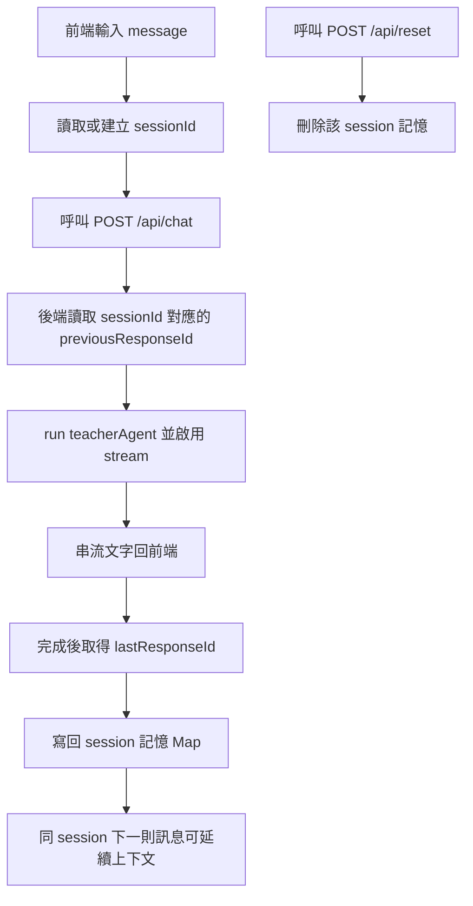

# OpenAI Agents SDK for TypeScript - Web UI 串流聊天範例

這是一個最小可執行範例，示範如何用 OpenAI Agents SDK 建立具備 UI 的聊天 agent，並在前端即時顯示串流輸出。

## 1) 安裝套件

```bash
npm install
```

## 2) 設定 API Key

```bash
cp .env.example .env
```

接著把 `.env` 裡的 `OPENAI_API_KEY` 改成你的金鑰。

## 3) 執行範例

```bash
npm run dev
```

開啟瀏覽器進入：

```text
http://localhost:3000
```

在 UI 中輸入訊息後，agent 回覆會以串流方式逐步顯示。

## 程式入口

- `src/index.ts`：Node.js Web 伺服器與 `/api/chat` 串流端點
- `public/index.html`：聊天介面
- `public/app.js`：前端送出訊息與接收串流
- `public/styles.css`：頁面樣式

可自行調整：

- `instructions`：agent 角色設定
- `model`：模型選擇

## Session Memory 運作說明（對照程式碼）

此專案的 session memory 是「以 `sessionId` 對應上一輪 `responseId`」，並在下一次呼叫時透過 `previousResponseId` 接續上下文。

### 對照重點

- `src/index.ts` 中的 `previousResponseBySession`：`Map<string, string>`，儲存 `sessionId -> lastResponseId`
- `POST /api/chat`：
  - 讀取 `sessionId`（若未提供則用 `default`）
  - 讀取 `previousResponseBySession.get(sessionId)` 並帶入 `run(..., { previousResponseId })`
  - 串流完成後用 `streamedResult.lastResponseId` 回寫到 `Map`
- `POST /api/reset`：收到 `sessionId` 後刪除該 key，清除該 session 記憶
- `public/app.js`：前端用 `localStorage` 保存 session id，重整頁面仍可延續同一段對話

### Mermaid 流程圖



### 注意事項

- 目前記憶是 in-memory（存在 Node 行程內），重啟服務後會消失
- 若要跨重啟保留，需把 `sessionId -> responseId` 改存到資料庫（如 Redis / Postgres）
