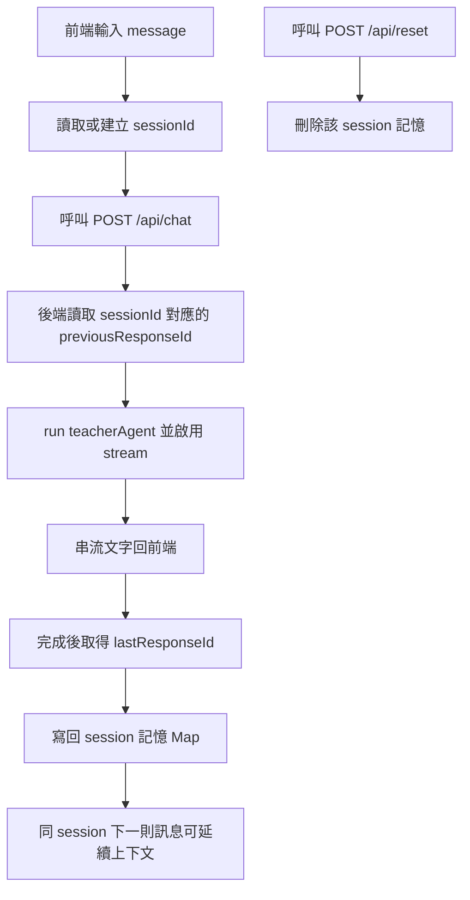

# OpenAI Agents SDK for TypeScript - Web UI 串流聊天範例

這是一個最小可執行範例，示範如何用 OpenAI Agents SDK 建立具備 UI 的聊天 agent，並在前端即時顯示串流輸出。

## 1) 安裝套件

```bash
npm install
```

## 2) 設定 API Key

```bash
cp .env.example .env
```

接著把 `.env` 裡的 `OPENAI_API_KEY` 改成你的金鑰，並設定 `MS_LEARN_MCP_URL`：

```dotenv
OPENAI_API_KEY=your_openai_api_key_here
MS_LEARN_MCP_URL=https://your-ms-learn-mcp-endpoint.example.com
```

## 3) 執行範例

```bash
npm run dev
```

執行測試（Vitest）：

```bash
npm test
```

依類型執行：

```bash
npm run test:integration
npm run test:unit
npm run test:e2e
```

開啟瀏覽器進入：

```text
http://localhost:3000
```

在 UI 中輸入訊息後，agent 回覆會以串流方式逐步顯示。

可先用健康檢查端點確認設定是否生效：

```bash
curl http://localhost:3000/api/health
```

你會看到：

- `openAiApiKeyConfigured`：`OPENAI_API_KEY` 是否已設定
- `msLearnMcpConfigured`：`MS_LEARN_MCP_URL` 是否已設定並啟用

## 程式入口

- `src/index.ts`：Express 伺服器啟動入口
- `src/app.ts`：Express app 組裝（middleware、API、靜態檔、錯誤處理）
- `src/routes/api.ts`：`/api/health`、`/api/chat`、`/api/reset`
- `src/services/chatService.ts`：Agent 路由判斷、MCP 連線與串流邏輯
- `public/index.html`：聊天介面
- `public/app.js`：前端送出訊息與接收串流
- `public/styles.css`：頁面樣式

## 測試目錄

- `tests/integration`：API 與串流行為測試
- `tests/unit`：單元測試（預留）
- `tests/e2e`：端對端測試（預留）

### 三層測試定位與撰寫準則

- `unit`：測單一模組或函式，不啟動 HTTP server、不走真實網路 I/O
- `integration`：測多模組協作（例如 `app + router + service`），可用 `supertest` 打 API
- `e2e`：測接近真實使用流程，啟動實際 server 後以 HTTP 呼叫驗證端到端行為

新增測試時，優先放在最小層級：

- 只驗證純邏輯或狀態轉換 → 放 `tests/unit`
- 驗證路由、middleware、回應格式、串流組裝 → 放 `tests/integration`
- 驗證從 client 視角的整體流程與部署行為 → 放 `tests/e2e`

建議原則：

- 單元測試應該最快、數量最多
- 整合測試聚焦 API contract 與模組邊界
- e2e 保持精簡，僅涵蓋關鍵主流程（smoke path）

### 命名慣例

- 單元與整合測試：`*.test.ts`（例如 `chatService.test.ts`、`app.test.ts`）
- 端對端測試：`*.e2e.test.ts`（例如 `health.e2e.test.ts`）
- 檔名建議使用 `feature.behavior.test.ts`，方便從檔名辨識測試目的
- 測試描述（`describe` / `it`）建議用行為句，例如「returns 400 when message is empty」

可自行調整：

- `instructions`：agent 角色設定
- `model`：模型選擇

## MS Learn MCP 與 C# 路由

此專案已支援在「C#/.NET 相關問題」時切換到含 MS Learn MCP 的 agent。

- MCP 連線型態：Streamable HTTP（讀取 `MS_LEARN_MCP_URL`）
- 路由方式：後端關鍵字判斷（例如 `c#`、`.net`、`linq`、`asp.net`）
- 行為限制：非 C# 問題不使用 MS Learn MCP
- 回答要求：C# 問題回覆末尾固定附「來源區塊」
  - 有來源時：
    - `【來源】`
    - `- MS Learn: <https://learn.microsoft.com/...>`
  - 無來源時：
    - `【來源】`
    - `- 無（本次未使用 MS Learn MCP）`
- 後端保險：若模型回覆缺少 `【來源】`，伺服器會在串流尾端自動補上「無來源」區塊
- 容錯降級：若 MCP 不可用或 C# MCP agent 請求失敗，會自動改用不含 MCP 的 C# fallback agent；若 fallback 也失敗才改用一般 agent（不中斷 API）

## Session Memory 運作說明（對照程式碼）

此專案的 session memory 是「以 `sessionId` 對應上一輪 `responseId`」，並在下一次呼叫時透過 `previousResponseId` 接續上下文。

### 對照重點

- `src/services/chatService.ts` 中的 `previousResponseBySession`：`Map<string, string>`，儲存 `sessionId -> lastResponseId`
- `POST /api/chat`：
  - 讀取 `sessionId`（若未提供則用 `default`）
  - 讀取 `previousResponseBySession.get(sessionId)` 並帶入 `run(..., { previousResponseId })`
  - 串流完成後用 `streamedResult.lastResponseId` 回寫到 `Map`
- `POST /api/reset`：收到 `sessionId` 後刪除該 key，清除該 session 記憶
- `public/app.js`：前端用 `localStorage` 保存 session id，重整頁面仍可延續同一段對話

### Mermaid 流程圖



### 注意事項

- 目前記憶是 in-memory（存在 Node 行程內），重啟服務後會消失
- 若要跨重啟保留，需把 `sessionId -> responseId` 改存到資料庫（如 Redis / Postgres）
